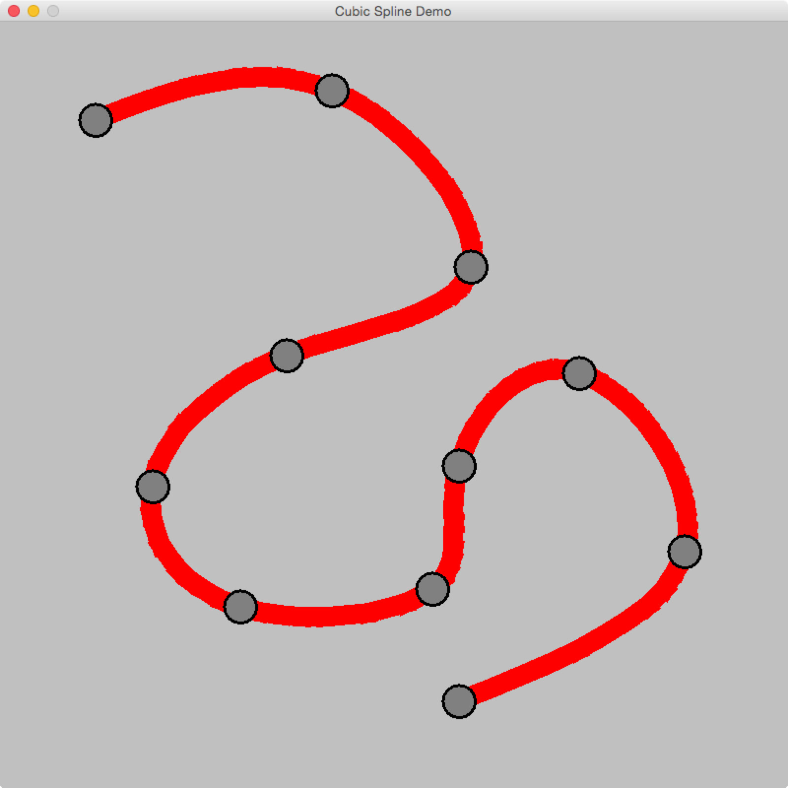

# CubicSplineDemo
A simple Java program demonstrating the use of cubic spline interpolation.

##How to use
To add a new Point, left click anywhere on the canvas.
You can also drag Points around.

To remove a Point, right click it. Using the 'C' key, all Points can be cleared at once.

##Download
An up-to-date .jar distribution (compiled with Java 7) is provided in the /dist folder of this repository.

